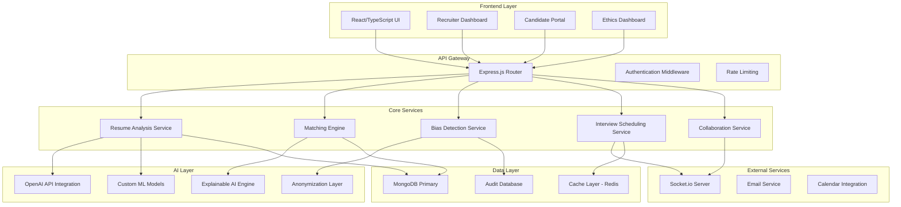

# TalentAlign AI Design Document

## Overview

TalentAlign AI is designed as a multi-layered ethical recruiting platform that prioritizes transparency, bias mitigation, and human augmentation. The system architecture follows a microservices pattern with clear separation between data processing, AI inference, bias detection, and user interfaces. The design emphasizes privacy-by-design principles, explainable AI, and continuous fairness monitoring.

## Architecture

### High-Level System Architecture



### Technology Stack

- **Frontend**: React 18+ with TypeScript, Material-UI for components, React Query for state management
- **Backend**: Node.js 18+ with Express.js, TypeScript for type safety
- **Database**: MongoDB 6+ with Mongoose ODM, Redis for caching and sessions
- **AI/ML**: OpenAI GPT-4 API, TensorFlow.js for custom models, scikit-learn for bias detection
- **Real-time**: Socket.io for collaborative features and live updates
- **Authentication**: JWT with refresh tokens, OAuth2 for third-party integrations
- **Monitoring**: Winston for logging, Prometheus for metrics, Grafana for visualization

## Components and Interfaces

### Core Service Components

#### 1. Resume Analysis Service

**Purpose**: Process and analyze candidate resumes while maintaining anonymity and detecting bias.

**Key Interfaces**:
```typescript
interface ResumeAnalysisService {
  analyzeResume(resumeData: Buffer, jobId: string): Promise<AnalysisResult>;
  extractSkills(content: string): Promise<SkillExtraction[]>;
  validateExperience(experience: ExperienceData): Promise<ValidationResult>;
  anonymizeContent(content: string): Promise<AnonymizedContent>;
}

interface AnalysisResult {
  skillsExtracted: SkillExtraction[];
  experienceValidation: ValidationResult;
  educationVerification: EducationResult;
  biasFlags: BiasFlag[];
  confidenceScore: number;
  anonymizedProfile: CandidateProfile;
}
```

**Implementation Strategy**:
- Use OpenAI API for natural language processing of resume content
- Implement custom NER (Named Entity Recognition) models for skill extraction
- Create anonymization pipeline that removes PII before analysis
- Integrate bias detection at multiple processing stages

#### 2. Matching Engine

**Purpose**: Generate transparent, explainable candidate-job matches with bias-free scoring.

**Key Interfaces**:
```typescript
interface MatchingEngine {
  generateMatches(jobId: string, candidatePool: CandidateProfile[]): Promise<MatchResult[]>;
  explainMatch(candidateId: string, jobId: string): Promise<MatchExplanation>;
  calculateCulturalFit(candidate: CandidateProfile, company: CompanyProfile): Promise<CulturalFitScore>;
  identifySkillsGaps(candidate: CandidateProfile, job: JobRequirements): Promise<SkillsGap[]>;
}

interface MatchResult {
  candidateId: string;
  overallScore: number;
  categoryScores: CategoryScore[];
  explanation: MatchExplanation;
  culturalFit: CulturalFitScore;
  growthPotential: GrowthAssessment;
}
```

**Implementation Strategy**:
- Implement weighted scoring algorithm with configurable bias constraints
- Use vector embeddings for semantic skill matching
- Create explainable AI layer that provides reasoning for each score component
- Implement fairness constraints using demographic parity and equalized odds

#### 3. Bias Detection Service

**Purpose**: Continuously monitor and detect bias across all system operations.

**Key Interfaces**:
```typescript
interface BiasDetectionService {
  detectJobDescriptionBias(jobDescription: string): Promise<BiasAnalysis>;
  monitorMatchingBias(matches: MatchResult[], demographics: DemographicData): Promise<BiasReport>;
  auditHiringFunnel(hiringData: HiringFunnelData): Promise<FairnessAudit>;
  generateAlerts(biasMetrics: BiasMetrics): Promise<BiasAlert[]>;
}

interface BiasAnalysis {
  biasScore: number;
  flaggedTerms: string[];
  suggestions: string[];
  fairnessMetrics: FairnessMetrics;
}
```

**Implementation Strategy**:
- Implement statistical parity testing across protected attributes
- Use adversarial debiasing techniques for model training
- Create real-time monitoring dashboard for bias metrics
- Implement automated alerting system for bias threshold violations

#### 4. Explainable AI Engine

**Purpose**: Provide human-readable explanations for all AI-generated decisions and recommendations.

**Key Interfaces**:
```typescript
interface ExplainableAIEngine {
  explainDecision(decision: AIDecision): Promise<Explanation>;
  generateVisualExplanation(data: ExplanationData): Promise<Visualization>;
  createSkillsProficiencyChart(skills: SkillAssessment[]): Promise<Chart>;
  buildCulturalAlignmentHeatmap(alignment: CulturalAlignment): Promise<Heatmap>;
}

interface Explanation {
  summary: string;
  factors: ExplanationFactor[];
  confidence: number;
  visualizations: Visualization[];
}
```

### Data Models

#### Core Data Structures

```typescript
// Anonymized candidate profile
interface CandidateProfile {
  id: string;
  skills: SkillAssessment[];
  experience: ExperienceRecord[];
  education: EducationRecord[];
  projects: ProjectRecord[];
  anonymizedAt: Date;
  consentGiven: boolean;
}

// Job requirements with bias detection
interface JobRequirements {
  id: string;
  title: string;
  requiredSkills: Skill[];
  preferredSkills: Skill[];
  experienceLevel: ExperienceLevel;
  culturalAttributes: CulturalAttribute[];
  biasAnalysis: BiasAnalysis;
  createdBy: string;
  createdAt: Date;
}

// Ethical AI requirements interface
interface EthicalAIRequirements {
  explainableDecisions: boolean;
  biasMonitoring: boolean;
  dataAnonymization: boolean;
  candidateConsent: boolean;
  algorithmTransparency: boolean;
  humanOversight: boolean;
}

// Fairness metrics tracking
interface FairnessMetrics {
  demographicParity: number;
  equalizedOdds: number;
  predictiveEquality: number;
  treatmentEquality: number;
  disparateImpact: number;
  statisticalSignificance: number;
}
```

## Error Handling

### Error Classification and Response Strategy

#### 1. AI Service Failures
- **OpenAI API Timeouts**: Implement exponential backoff with circuit breaker pattern
- **Model Inference Errors**: Fallback to simpler rule-based systems with degraded functionality
- **Bias Detection Failures**: Fail-safe to manual review process with human oversight

#### 2. Data Privacy Violations
- **PII Exposure**: Immediate data quarantine and audit trail generation
- **Consent Violations**: Automatic data deletion and compliance notification
- **Anonymization Failures**: System lockdown until manual verification

#### 3. Fairness Threshold Violations
- **Bias Alert Triggers**: Automatic model retraining and human review escalation
- **Demographic Disparity**: Immediate matching algorithm adjustment and audit
- **Compliance Violations**: System suspension and regulatory notification

### Error Response Framework

```typescript
interface ErrorHandler {
  handleAIServiceError(error: AIServiceError): Promise<ErrorResponse>;
  handlePrivacyViolation(violation: PrivacyViolation): Promise<ComplianceResponse>;
  handleBiasAlert(alert: BiasAlert): Promise<FairnessResponse>;
  generateAuditTrail(incident: SecurityIncident): Promise<AuditRecord>;
}
```

## Testing Strategy

### Multi-Layered Testing Approach

#### 1. Bias Testing Framework
- **Synthetic Data Generation**: Create diverse test datasets across demographic groups
- **Fairness Validation**: Automated testing of all fairness metrics with statistical significance
- **Adversarial Testing**: Red-team exercises to identify potential bias vulnerabilities
- **Cross-Industry Validation**: Test bias detection across different industry contexts

#### 2. AI Model Testing
- **Explainability Validation**: Verify that all AI decisions include human-readable explanations
- **Performance Benchmarking**: Test matching accuracy against industry-standard datasets
- **Robustness Testing**: Evaluate model performance under edge cases and adversarial inputs
- **Drift Detection**: Monitor model performance degradation over time

#### 3. Privacy and Security Testing
- **Data Anonymization Verification**: Ensure PII removal is complete and irreversible
- **Consent Management Testing**: Validate consent workflows and data portability features
- **Penetration Testing**: Regular security assessments of data handling and storage
- **GDPR/CCPA Compliance Audits**: Automated compliance checking and reporting

#### 4. Integration Testing
- **End-to-End Workflows**: Test complete hiring workflows from resume upload to decision
- **Real-time Collaboration**: Validate Socket.io functionality under concurrent user loads
- **Third-party Integrations**: Test calendar, email, and external API integrations
- **Performance Testing**: Load testing with 1000+ concurrent users and large datasets

### Testing Infrastructure

```typescript
interface TestingFramework {
  runBiasTests(testSuite: BiasTestSuite): Promise<BiasTestResults>;
  validateFairness(metrics: FairnessMetrics): Promise<ValidationResult>;
  testExplainability(decisions: AIDecision[]): Promise<ExplainabilityReport>;
  auditPrivacyCompliance(dataFlow: DataFlow): Promise<ComplianceReport>;
}
```

### Continuous Monitoring and Validation

- **Real-time Bias Monitoring**: Continuous statistical analysis of hiring outcomes
- **Model Performance Tracking**: Automated alerts for accuracy degradation
- **User Experience Monitoring**: Track user satisfaction and system adoption rates
- **Regulatory Compliance Monitoring**: Automated compliance checking and reporting

This design provides a robust foundation for building TalentAlign AI with strong emphasis on ethical AI practices, transparency, and bias mitigation while maintaining high performance and user experience standards.